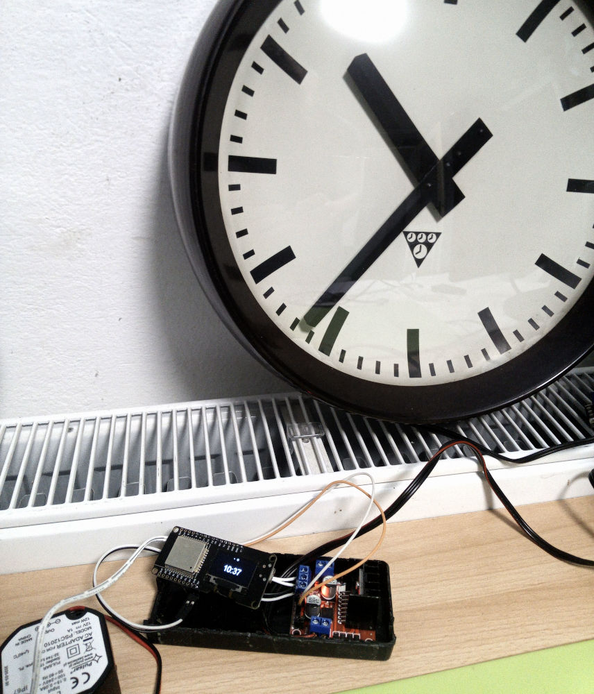

# Slave clock controller based on ESP8266 hardware

This project is intended to implement a slave clock impulse driver using ESP32 hardware
with an OLED display. The time source is NTP, so no RTC module is needed. The code supports timezone
and DST rules. The state of the slave clock is stored in the Non-Volatile memory to survive power loss or reboot. Board time as well as slave clock time is displayed on the OLED screen.

See [my blog posts](https://smallhacks.wordpress.com/2020/09/26/esp32-based-old-clock-controller-with-ntp-sync/) for the additional details. 

## Requirements

### Software

 - [Arduino Timezone Library](https://github.com/JChristensen/Timezone)
 - [Arduino Time Library ](https://playground.arduino.cc/Code/Time)
 - [ThingPulse OLED SSD1306 Library](https://github.com/ThingPulse/esp8266-oled-ssd1306)
 
### Hardware
 
 - [ESP-WROOM-32 0.96" OLED ESP32 WIFI-BT Dual-mode 2.4GHz For Wemos D1 AP STA](https://www.ebay.com/itm/ESP-WROOM-32-0-96-OLED-ESP32-WIFI-BT-Dual-mode-2-4GHz-For-Wemos-D1-AP-STA-/332196121504)
 - [L298N motor driver module H-Bridge](https://www.instructables.com/id/Control-DC-and-stepper-motors-with-L298N-Dual-Moto/). 
 - 12V 1A power supply
 
## How it works

- L298N driver is used to generate 12V impulses to drive the clock and to provide 5V power
  to the ESP board. It also allows to invert output polarity, so no relays needed. 
- After startup ESP trying to connect to WIFI and get time from the NTP
- If time is synced - ESP compares it with slave time in the Non-Volatile memory and updates the slave clock
- Slave status is stored in Non-Volatile memory every minute, using [Preferences](https://github.com/espressif/arduino-esp32/tree/master/libraries/Preferences) library on the [NVS partition](https://docs.espressif.com/projects/esp-idf/en/latest/esp32/api-reference/storage/nvs_flash.html) to optimize wear-out. Probably using the I2C FRAM module for that would be a better choice.
- Code respects configured timezone and automatically synced to NTP every 5m
- There is a special "init mode" to sync hardware slave with the controller
- At the moment we are using only one (first) channel of the L298N. The second could be used for the alarm or led backlight. 

## Init mode

As ESP has no information about the slave clock position - we need to sync them. To do this - connect PIN_INIT (15) pin to GND and restart ESP. It will move arrows every second. Wait until the clock shows **12:00** and immediately unplug the wire. The clock will be synced with ESP and will switch to normal mode. 

## Final result (not yet in a box)

## Related links
- Another slave clock project, based on ESP8266: software ([gitlab.com/close2/nebenuhr](https://gitlab.com/close2/nebenuhr)) and hardware ([gitlab.com/close2/nebenuhr_hardware/](https://gitlab.com/close2/nebenuhr_hardware))
